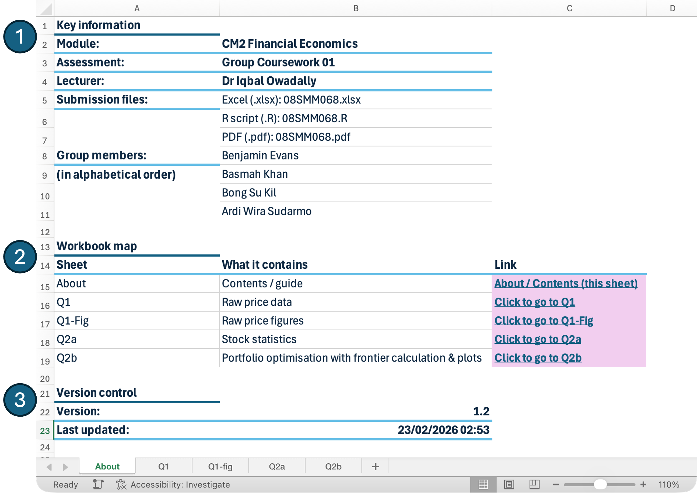
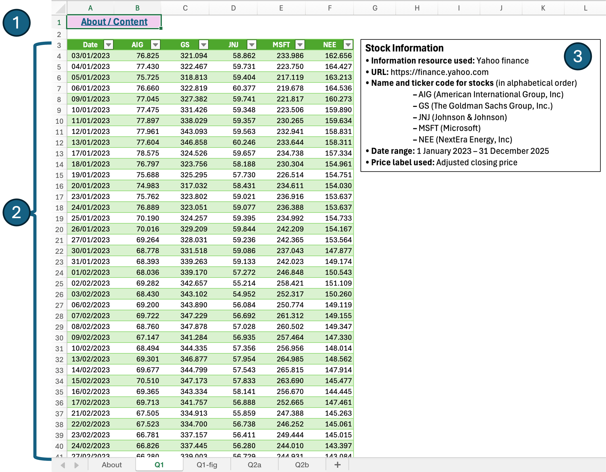
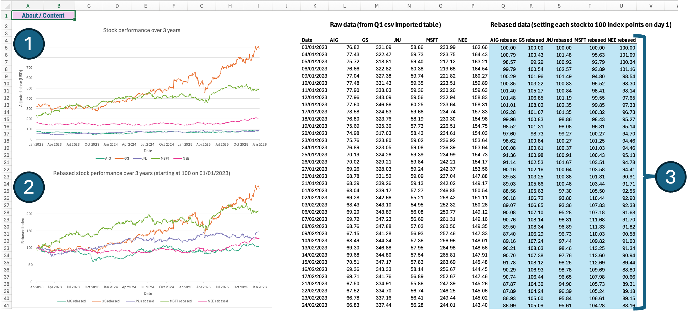
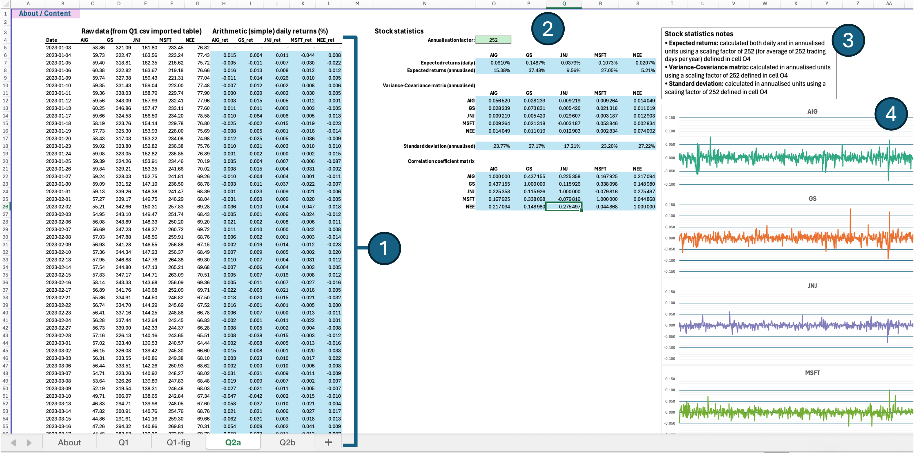
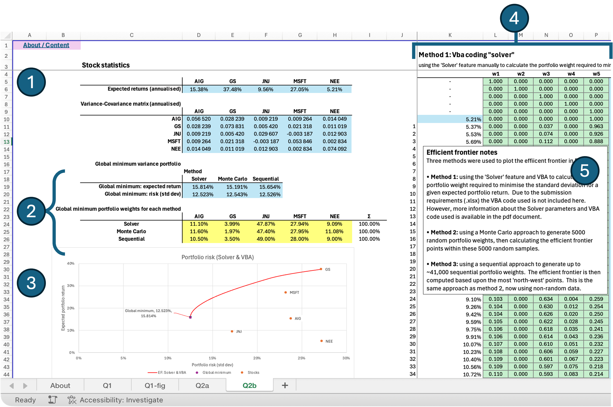

```{=latex}
\newpage
```

```{=html}
<h1>Information</h1>

This R Markdown document was created as part of a group assignment for SMM068 at Bayes Business School, City St George's, University of London in Term 2 2025-26.

```

```{r asthetic-header, include=FALSE, echo=FALSE}
# ==============================================================================
# SMM068 Financial Economics (Subject CM2)
# Group Coursework 2025-26
# Group:        Group 08
# Authors (in alphabetical order):
#   - Benjamin Evans
#   - Basmah Khan
#   - Bong Su Kil
#   - Ardi Wira Sudarmo
# Professor:    Dr. Iqbal Owadally
# Institution:  Bayes Business School - City St George's, University of London
# Date:         TBC~
# Description:  Term 2 group project for SMM068 Financial Economics
# (50% of coursework grade - 10% of module grade). The R code below
# has been exported directly from an R Markdown (.rmd) file.  Hence the knitr
# settings.
# Dependencies:
#   - TBI
# Acknowledgements
#   - TBI
# ==============================================================================

```

```{r setup-knitr, include=FALSE, echo=FALSE}
#----------------------- Initial setup (knitr settings) -----------------------#
dir.create("fig", showWarnings = FALSE)

# Defaults common to all outputs
knitr::opts_chunk$set(
  echo     = TRUE,
  message  = FALSE,
  warning  = FALSE,
  fig.align = "center",
  out.width = "100%",
  fig.path  = "fig/",
  dpi       = 300
)

# Output-specific settings
if (knitr::is_latex_output()) {
  knitr::opts_chunk$set(
    fig.width = 6,
    fig.height = 4,
    dev = "pdf",
    fig.pos = "!ht",
    out.extra = ""
  )
} else {
  knitr::opts_chunk$set(
    fig.width = 6,
    fig.height = 4,
    dev = "svglite"  # or "png"
  )
}
```

```{r setup-qol, include=FALSE, echo=FALSE}
#----------------------------- Clean environment ------------------------------#
rm(list = ls()) # Remove all objects
graphics.off() # Close all graphical devices
cat("\014") # Clean console
```

```{r load-dependencies, include=FALSE, echo=FALSE}
#------------------- Load dependencies / external libraries -------------------#
library(quantmod) # for downloading

library(kableExtra) # for general tables
library(DT) # for HTML interactive data tables
library(ggplot2) # for plotting
library(patchwork) # for combining multiple plots into one figure
library(plotly) # for interactive html plots

library(dplyr) # wrangle data for reporting
library(tidyr) # reshape data for reporting

# BE note: not sure if we will need xts or zoo, but have left in for now
library(xts) # for downloading / financial data analysis (used in CS1)
library(zoo) # for downloading / financial data analysis (used in CS1)

# BS note : for Q2
library(rootSolve) # This finds roots of (fairly straightforward) equations
library(optimx)   #  This handles non-linear unconstrained optimization (as well as box-constrained).
library(quadprog) # to solve a quadratic programming problem
library(scales) # to express portfolio weights as percentage
library(pander)


```

```{r html-app, echo=FALSE, results='asis', eval=knitr::is_html_output(), purl=FALSE}
#------------------------------ HTML link to app ------------------------------#
library(htmltools)

div(style = "background-color: #f8f9fa; padding: 20px; border: 1px solid #e9ecef; border-radius: 5px; text-align: center; margin-bottom: 30px;",
  h3("Bonus Interactive Dashboard Available"),
  p("This static report is accompanied by a live R Shiny dashboard allowing one to test different tickers, exclude specific outlier periods, and adjust bootstrap simulation parameters."),
  a(href = "https://3enji.shinyapps.io/SMM047-202526-Group07-Dashboard/",
    target = "_blank",
    class = "btn btn-primary",
    style = "background-color: #007bff; color: white; padding: 10px 20px; text-decoration: none; border-radius: 5px; font-weight: bold;",
    "Launch Interactive Dashboard")
)
```

```{r custom-functions, include=FALSE, echo=FALSE}
#---------------------------- Custom QOL functions ----------------------------#
#####################################
# function: banner comments (used to to section up code)
# Usage: banner_comment("Element 1: data cleaning") -> then ctrl + v (or cmd+v)
#####################################
banner_comment <- function(text, width = 80, border = "#", fill = "-") {
  txt <- paste0(" ", text, " ")
  inner_width <- width - 2 * nchar(border)
  banner_string <- ""

  if (inner_width <= nchar(txt)) {
    banner_string <- paste0(border, txt, border)
  } else {
    pad_total <- inner_width - nchar(txt)
    pad_left <- pad_total %/% 2
    pad_right <- pad_total - pad_left

    banner_string <- paste0(
      border,
      strrep(fill, pad_left),
      txt,
      strrep(fill, pad_right),
      border
    )
  }

  cat(banner_string, "\n")
  # copy banner to allow direct pasting (requires clipr)
  clipr::write_clip(banner_string)
  # avoid [1] when printing if want to manually copy
  invisible(banner_string)
}
#####################################
# function: format p-values for text
# Usage (in-line): `r format_p_vals(ad_test_result$p.value)`
# Usage (console): format_p_vals(ad_test_result$p.value)
#####################################
format_p_vals <- function(p) {
  if (length(p) != 1L || is.na(p)) {
    stop("Error! p must be a single non-missing value")
  }
  if (p > 1) {
    stop("Error! Value greater than 1")
  }
  if (p < 0) {
    stop("Error! Value less than 0")
  }

  if (p >= 0.01) {
    paste0("= ", formatC(p, format = "f", digits = 2))
  } else if (p >= 0.001) {
    paste0("= ", formatC(p, format = "f", digits = 3))
  } else {
    "< 0.001"
  }
}
#####################################
# function: format confidence intervals for tables & text
# Usage (in-line): `r format_interval(el2_ci_normal_95[1], el2_ci_normal_95[2])`
# Usage (console): format_interval(el2_ci_normal_95[1], el2_ci_normal_95[2])
#####################################
format_interval <- function(lower, upper, digits = 3, small_interval = 5L) {
  paste0(
    "[",
    formatC(
      lower,
      format = "f",
      digits = digits,
      small.interval = small_interval,
      small.mark = " "
    ),
    ", ",
    formatC(
      upper,
      format = "f",
      digits = digits,
      small.interval = small_interval,
      small.mark = " "
    ),
    "]"
  )
}
#####################################
# function: format truncated ellipses
# Usage (in-line): `r tbi`
# Usage (console): tbi
#####################################
fmt_trunc_ellip <- function(
  x,
  digits = 7,
  ellip = "...",
  tol = 1e-12,
  trim_zeros_if_exact = TRUE
) {
  out <- rep(NA_character_, length(x))
  ok <- is.finite(x)
  scale <- 10^digits
  xt <- trunc(x[ok] * scale) / scale
  s <- formatC(xt, format = "f", digits = digits)
  add <- abs(x[ok] - xt) > tol * pmax(1, abs(x[ok]))
  if (trim_zeros_if_exact) {
    s_trim <- sub("0+$", "", s) # drop trailing zeros
    s_trim <- sub("\\.$", "", s_trim) # drop trailing decimal point
  } else {
    s_trim <- s
  }
  out[ok] <- ifelse(add, paste0(s, ellip), s_trim)
  out[is.na(x)] <- NA_character_
  out
}
```

# Downloading the data

```{r Q1, echo=knitr::is_html_output(), include=FALSE}
# ==============================================================================
# Q1 5 Stocks in U.S market
# ==============================================================================

# R code goes here
# Five insurance-related stocks are chosen
# The specific choice of stocks is flexible, as the primary objective

#stocks <- sort(c("TRV", "PGR", "ALL", "CB", "AIG"))
stocks <- sort(c("MSFT", "JNJ", "NEE", "AIG", "GS"))

start_date <- as.Date("2023-01-01")
end_date <- as.Date("2025-12-31")

cache_file <- paste0("cache_", paste(stocks, collapse = "_"), ".rds")

# Download only if file doesn't exist (avoiding throttling by Yahoo Finance).
# Without this code the stocks data are downloaded fresh every time wecompile
# the document (because we are using RMarkdown)
if (file.exists(cache_file)) {
  message("Loading from RDS cache...")
  prices <- readRDS(cache_file)
} else {
  message("Cache not found. Downloading from Yahoo Finance...")

  data_env <- new.env()
  getSymbols(
    stocks,
    src = "yahoo",
    from = start_date,
    to = end_date,
    env = data_env
  )

  # Get Adjusted Prices and merge dynamically (allows for more stocks)
  price_list <- lapply(data_env, Ad)
  prices_xts <- do.call(merge, price_list)

  prices <- data.frame(Date = index(prices_xts), coredata(prices_xts))
  # Ensure names match sorted list
  colnames(prices) <- c("Date", stocks)

  # Save to RDS (preserves datatypes)
  saveRDS(prices, cache_file)
}

# Q1-1 Adjusted close extract

head(prices)
tail(prices)

write.csv(prices, "Q1.csv", row.names = FALSE)
```

<!-- _Download 3 years of daily prices for 5 U.S. stocks. [5 marks]_ -->

- **Information resource used:** Yahoo finance
- **URL:** https://finance.yahoo.com (accessed 2026-01-28)
- **Name and ticker code for stocks** (in alphabetical order):
  - AIG (American International Group, Inc)
  - GS (The Goldman Sachs Group, Inc.)
  - JNJ (Johnson & Johnson)
  - MSFT (Microsoft)
  - NEE (NextEra Energy, Inc)

- **Date range:** 1 January 2023 – 31 December 2025
- **Price label used:** Adjusted closing price (to account for corporate actions such as splits/dividends)
- **Rationale:** The five stocks were chosen to provide diversification across industries (technology, healthcare, utilities/renewables, insurance/financial services, and investment banking) from large, U.S. listed, liquid companies with continuous daily price histories.

```{r Q1-table-for-html, include=knitr::is_html_output(), echo=FALSE, message=FALSE, warning=FALSE}
if (knitr::is_html_output()) {
  datatable(
    prices,
    options = list(
      pageLength = 10,
      searching = TRUE,
      ordering = TRUE,
      autoWidth = TRUE,
      columnDefs = list(list(className = 'dt-center', targets = "_all"))
    ),
    caption = "Chosen insurance stock prices (adjusted close)",
    rownames = FALSE
  ) %>%
    # These are US stocks -> add USD currency format
    formatCurrency(columns = stocks, currency = "$") %>%
    formatStyle(
      'Date',
      target = 'row'
      # fontWeight = styleRow(1:10, "bold"),
    )
}
```


```{r Q1-stock-price-plots, eval=TRUE, echo=FALSE, fig.width=8, fig.height=6.6, fig.cap="Adjusted daily closing prices (top) and rebased performance (bottom) for selected stocks (2023–2025).", fig.pos='!ht', message=FALSE, warning=FALSE}
# Transform to long format for ggplot
df_long <- prices %>%
  pivot_longer(
    cols = -Date,
    names_to = "Ticker",
    values_to = "Price"
  ) %>%
  mutate(Date = as.Date(Date))

# Rebased series (start of sample = 100 for each ticker)
df_rebased <- df_long %>%
  group_by(Ticker) %>%
  arrange(Date) %>%
  mutate(Rebased = 100 * Price / first(Price)) %>%
  ungroup()

# theme elements
base_theme <- theme_bw() +
  theme(
    plot.title = element_text(hjust = 0.5, face = "bold"),
    legend.position = "bottom",
    panel.grid.minor = element_blank(),
    plot.margin = margin(10, 10, 10, 10)
  )

# consistent colours
pal <- RColorBrewer::brewer.pal(8, "Dark2")
my_cols <- setNames(pal[c(1, 2, 3, 5, 4)], sort(unique(df_long$Ticker)))

# --- x-axis: force start at Jan 1 of first year, end at last observed date
# --- for subtitle text only
date_min_txt <- format(min(df_long$Date), "%Y-%m-%d")
date_max_txt <- format(max(df_long$Date), "%Y-%m-%d")

# --- anchor ticks to January 1 of the first year
x_jan1 <- as.Date(paste0(format(min(df_long$Date), "%Y"), "-01-01"))

# --- add 1 month "breathing room" either side
x_min_pad <- seq(x_jan1, by = "-1 month", length.out = 2)[2]
x_max_pad <- seq(max(df_long$Date), by = "1 month",  length.out = 2)[2]

# --- breaks anchored at January (first tick will be Jan)
x_breaks <- seq(x_jan1, x_max_pad, by = "6 months")

x_scale <- scale_x_date(
  limits = c(x_min_pad, x_max_pad),
  breaks = x_breaks,
  date_labels = "%b %Y",
  expand = c(0, 0)
)

# --- Plot 1: absolute adjusted close
p_abs <- ggplot(df_long, aes(x = Date, y = Price, color = Ticker)) +
  geom_line(linewidth = 0.8, alpha = 0.9) +
  scale_color_manual(values = my_cols) +
  labs(
    title = "Performance of selected stocks over 3 years",
    subtitle = paste("Date range:", date_min_txt, "to", date_max_txt),
    x = "Date",
    y = "Adjusted close (USD)",
    color = "Stock:"
  ) +
  x_scale +
  base_theme

# --- Plot 2: rebased (start for all = 100)
p_reb <- ggplot(df_rebased, aes(x = Date, y = Rebased, color = Ticker)) +
  geom_line(linewidth = 0.8, alpha = 0.9) +
  scale_color_manual(values = my_cols) +
  labs(
    title = "Rebased stock performance",
    subtitle = paste("Rebased:", date_min_txt, "= 100"),
    x = "Date",
    y = "Rebased index",
    color = "Stock:"
  ) +
  x_scale +
  base_theme

if (knitr::is_html_output()) {
  # slightly thinner lines for plotly
  p_abs_html <- p_abs + geom_line(linewidth = 0.5, alpha = 0.9)
  p_reb_html <- p_reb + geom_line(linewidth = 0.5, alpha = 0.9)

  w1 <- ggplotly(p_abs_html, height = 420) %>%
    layout(
      title = list(x = 0.5, xanchor = "center"),
      legend = list(
        orientation = "h",
        x = 0.5,
        xanchor = "center",
        y = -0.2,
        yanchor = "top"
      ),
      margin = list(t = 70, b = 90, l = 70, r = 20)
    ) %>%
    config(responsive = TRUE)

  w2 <- ggplotly(p_reb_html, height = 420) %>%
    layout(
      title = list(x = 0.5, xanchor = "center"),
      legend = list(
        orientation = "h",
        x = 0.5,
        xanchor = "center",
        y = -0.2,
        yanchor = "top"
      ),
      margin = list(t = 70, b = 90, l = 70, r = 20)
    ) %>%
    config(responsive = TRUE)

  tagList(w1, tags$br(), w2)
} else {

  (p_abs / p_reb) +
    plot_layout(guides = "collect") &
    theme(legend.position = "bottom")
}
```

```{=latex}
\clearpage
\newpage
```

# Portfolio optimisation

Note: average daily returns were converted to annualised units. (foot note here
recognising alternative ways of doing this, but stating that this is the way we
chose).

$$
z_{ann} = z_{daily} \times 252
$$


$$
\begin{array}{ll}
\hline
\textbf{Quantity} & \textbf{Expression} \\
\hline
\text{Portfolio return }  &
  R_p = \sum_{i=1}^{N} R_i
  \\[6pt]
\text{Expected portfolio return}
  &\overline{R}_p = \mathbb{E}[R_p] = \sum_{i=1}^{N} x_i \, \overline{R}_i \\[6pt]
\text{Standard deviation of portfolio return }
  & \sigma_p^2 = \sum_{i=1}^{N} x_i^2 \sigma_i^2 + 2 \sum_{i=1}^{N-1}
    \sum_{j=i+1}^{N} x_i x_j \rho_{ij} \sigma_i \sigma_j \\[6pt]
\text{Constraints 1}
  & \sum_{i=1}^{N} x_i = 1  \\[6pt]
\text{Constraints 2}
  & \sum_{i=1}^{N}x_i\overline{R_i} = E \\[6pt]
\hline
\end{array}
$$

```{r Q2-working, echo=FALSE, fig.pos="!ht"}
# ==============================================================================
# Q2(a) estimate all required statistics for the 5 stocks
# ==============================================================================

# prices_mat <- as.matrix(prices[, -1])
# returns <- log(prices_mat[-1, ]) - log(prices_mat[-nrow(prices_mat), ])
#
# colnames(returns) <- colnames(prices_mat)
#
# mean_returns_d <- colMeans(returns)
# cov_matrix_d <- cov(returns)
# sd_d  <- sqrt(diag(cov_matrix_d))
#
# # Q2(a)_ annual expectation and covariance
#

# drop date column
px <- prices[, -1]

#%returns
data1 <- lapply(px, function(x) {
  ROC(as.numeric(x), type = "discrete") 
})

ret1 <- as.data.frame(do.call(cbind, data1))
colnames(ret1) <- colnames(px)


# remove the first row of missing values
ret1 <- ret1[-1, , drop = FALSE]

# add dates column
ret1 <- data.frame(Date = prices$Date[-1], ret1)

# plot the data
pander(head(ret1), split.table = Inf)

# convert to long

ret_long = pivot_longer(ret1, cols = -c(Date), values_to = "Return", names_to = "Stock")

# plot

port_p1 = ggplot(ret_long, aes(Date, Return, color = Stock)) + geom_path(stat = "identity") +
    facet_grid(Stock ~ .) + theme_minimal() + labs(x = "Date", y = "Returns")
port_p1

R_pct <- as.matrix(ret1[, -1])

mean_returns_d <- colMeans(R_pct)
cov_matrix_d   <- cov(R_pct)
sd_d           <- sqrt(diag(cov_matrix_d))

# BE note to check: why factors of 3/100?
# /3 to get 1 year's worth of data
# then *100 to get 1 year as a %
# - Wait for Ardi's attempt before editing...
mean_returns_a <- mean_returns_d * nrow(R_pct) * 252
cov_matrix_a <- cov_matrix_d* nrow(R_pct) * 252
sd_a <- sd_d*sqrt(cov_matrix_d* nrow(R_pct) * 252)
N_return <- length(mean_returns_a)

```

## Stock statistics Q2(a) {#qtwoa}

In preparation for mean-variance portfolio optimization, estimate all required
statistics for the 5 stocks whose price data you downloaded in Q1.

<!-- - Required statistics include? -->
<!-- - Mean: -->
<!-- - Variance: -->
<!-- - Skewness: -->
<!-- - Kurtosis / excess kurtosis?: -->
<!-- - Covariance table -->


```{r Q2a-working-Ardi}

df_day_returns <- prices |>
  arrange(Date) |> 
  mutate(across(all_of(stocks), ~  .x / lag(.x) - 1 ))

# Multiply by 252 trading days in a year to convert daily return to annual
ANNUALISED.FACTOR <- 252

mean_returns_a <- df_day_returns |>
    summarize(across(where(is.numeric), ~ mean(.x, na.rm=TRUE) * ANNUALISED.FACTOR )) |>
    unlist()

# Annualised covariance matrix 

cov_matrix_a <- cov(as.matrix(df_day_returns[-1,-1])) * ANNUALISED.FACTOR

```


Daily returns were calculated from the adjusted closing prices of the five stocks. The expected returns were obtained by taking the average of the daily returns and the annualised.

The variance–covariance matrix were also estimated using the same daily returns and annualised accordingly.
The results show that the stocks have different levels of return and risk

Answer: 

Mean(%)
```{r, echo=FALSE}
library(knitr)

mean_table <- round(
  rbind(
    Daily_Return  = mean_returns_d * 100,
    Annual_Return = mean_returns_a * 100
  ), 4
)

colnames(mean_table) <- colnames(ret1)[2:6]

mean_table
```

Covariance
```{r Q2a, echo=FALSE}
cov_matrix_a
```

Standard-deviation
```{r Q2a_1, echo=FALSE}
vol <- sqrt(diag(cov_matrix_a))
vol
```

Correlation

```{r Q2a_2, echo=FALSE}
corr <- cor(R_pct)
corr
```

<!-- Skewness -->
<!-- ```{r Q2a_3, echo=FALSE} -->

<!-- library(e1071) -->
<!-- skew <- apply( -->
<!--   R_pct, -->
<!--   2, -->
<!--   function(x) skewness(x, na.rm = TRUE, type = 3) -->
<!-- ) -->

<!-- round(skew, 6) -->
<!-- ``` -->

<!-- Answer:  -->

<!-- Daily return  -->

<!-- `r sprintf("%s %.5f",colnames(ret1)[2], mean_returns_d[1])`% (5dp) -->
<!-- `r sprintf("%s %.5f",colnames(ret1)[3], mean_returns_d[2])`% (5dp) -->
<!-- `r sprintf("%s %.5f",colnames(ret1)[4], mean_returns_d[3])`% (5dp) -->
<!-- `r sprintf("%s %.5f",colnames(ret1)[5], mean_returns_d[4])`% (5dp) -->
<!-- `r sprintf("%s %.5f",colnames(ret1)[6], mean_returns_d[5])`% (5dp) -->
<!-- \\ -->

<!-- `r sprintf("%s %.3f",colnames(ret1)[2], mean_returns_a[1]*100)`% (3dp) -->
<!-- `r sprintf("%s %.3f",colnames(ret1)[3], mean_returns_a[2]*100)`% (3dp) -->
<!-- `r sprintf("%s %.3f",colnames(ret1)[4], mean_returns_a[3]*100)`% (3dp) -->
<!-- `r sprintf("%s %.3f",colnames(ret1)[5], mean_returns_a[4]*100)`% (3dp) -->
<!-- `r sprintf("%s %.3f",colnames(ret1)[6], mean_returns_a[5]*100)`% (3dp) -->

<!-- # ```{r, echo=FALSE} -->
<!-- # df <- data.frame( -->
<!-- #   Stock = stocks, -->
<!-- #   # Format: "12.345% (3dp)" -->
<!-- #   Return = sprintf("%.3f (3dp)", mean_returns_a * 100)  -->
<!-- # ) -->
<!-- #  -->
<!-- # kable(df,  -->
<!-- #       col.names = c("Stock", "Mean Return perc. (3dp)"),  -->
<!-- #       caption = "Answer: Portfolio Returns", -->
<!-- #       booktabs = TRUE, -->
<!-- #       escape = FALSE, -->
<!-- #       align = "lc", -->
<!-- # ) %>% -->
<!-- #   kable_styling( -->
<!-- #     full_width = FALSE, -->
<!-- #     position = "center", -->
<!-- #     latex_options = "hold_position" -->
<!-- #   ) -->
<!-- # ``` -->


```{=latex}
\newpage
```

## Q2b {#qtwob}

We attempt to find portfolio weights $w$ that minimise the portfolio variance while yielding the target mean return $E$,

i.e. a solution to the following optimisation problem:

<!-- prettier-ignore -->
\begin{align*}
\min &\quad {w}^T {D} {w} \\
\text{s.t.} &\quad {1}^T {w} = 1 \\
  &\quad \overline{{R}}^T {w} = E \\
  &\quad {w} \geq {0}
\end{align*}

We are using `solve.QP` function to solve a quadratic programming problem of the form:

<!-- prettier-ignore -->
\begin{align*}
\min &\quad \frac{1}{2}{w}^T {D} {w} - {d}^T {w} \\
\text{s.t.} &\quad {A}^T {w} \geq {b_0}
\end{align*}


We therefore set:

$$
{d} = {0}, 
\quad
{A} = 
\begin{bmatrix} 
  {1}^T \\
  \overline{{R}}^T \\
  {I}_5 \\
\end{bmatrix}, 
\quad
{b_0} =
\begin{bmatrix}
  1 \\
  E \\
  {0}_5 \\
\end{bmatrix}
$$

as arguments to the `solve.QP` function.

```{r Q2b-working-Ardi, fig.pos="!ht"}

n_sec <- length(stocks)

# matrix D is the stocks' covariance matrix
Dmat <- cov_matrix_a

# dvec is a (5x1) vector of 0's
dvec <- rep(0, n_sec)

# Sum of weights = 1 constraint
ct_1_lhs <- rep(1, n_sec)
ct_1_rhs <- 1

# Target portfolio constraint
ct_2_lhs <- mean_returns_a

# vector of target returns
targets <- seq(min(mean_returns_a), max(mean_returns_a), length.out = 200)

res <- lapply(targets, function(tar) {
  
  Amat <- cbind(ct_1_lhs, ct_2_lhs, diag(n_sec))
  b0vec <- c(ct_1_rhs, tar, rep(0, n_sec))

  sol <- tryCatch(
    solve.QP(Dmat, dvec, Amat, b0vec, meq = 2),
    error = function(e) NULL
  )
  if (is.null(sol)) {
    return(NULL)
  }

  w <- sol$solution
  w[w < 1e-10] <- 0
  w <- w / sum(w)

  c(
    risk = sqrt(t(w) %*% cov_matrix_a %*% w),
    ret = sum(w * mean_returns_a)
  )
  
})

res <- do.call(rbind, res)


plot(
  res[, "risk"],
  res[, "ret"],
  type = "l",
  col = "red",
  lwd = 1,
  xlab = "Mean-Var target Risk",
  ylab = "Expected Return",
  xlim = range(res[, "risk"]) * c(0.98, 1.02),
  ylim = range(mean_returns_a) * c(0.9, 1.1),
  main = "Efficient Frontier (No short selling)"
)
grid()
i_gmv <- which.min(res[, "risk"])

lines(
  res[i_gmv:nrow(res), "risk"],
  res[i_gmv:nrow(res), "ret"],
  col = "darkgreen",
  lwd = 2
)

asset_cols <- c("red", "blue", "orange", "purple", "brown")
points(
  sqrt(diag(cov_matrix_a)),
  mean_returns_a,
  pch = 16,
  cex = 1.3,
  col = asset_cols
)

text(
  sqrt(diag(cov_matrix_a)),
  mean_returns_a,
  labels = names(mean_returns_a),
  pos = 4,
  cex = 0.9,
  col = asset_cols
)


```


```{r Q2b-working-Bongsu, eval=FALSE, include=FALSE}
# ==============================================================================
# Q2(b) estimate all required statistics for the 5 stocks
# ==============================================================================
# method log return
# ==============================================================================

# number of securities
n_sec <- ncol(cov_matrix_a)

# Budget constraint
ct_1_lhs <- rep(1, n_sec)
ct_1_rhs <- 1

#  Target return constraint: x_1 mu_1 + x_2 mu_2 + x_3 mu_3 + x_4 mu_4
#                            + x_5 mu_5= mu_target <=> mu^T x = mu_target

ct_2_lhs <- mean_returns_a
ct_2_rhs <- mean(mean_returns_a)

#  Optimization. There is one constraint: the budget constraint

dmat <- cov_matrix_a

# dvec is a column vector of 0's
dvec <- cbind(rep(0, n_sec))
amat <- rbind(ct_1_lhs, diag(n_sec)) # Creates a row vector
bvec <- c(ct_1_rhs, rep(0, n_sec))
meq <- 1 # One equality constraint

# Solve for global min var portfolio. t() is the transpose function
pf_gbl <- solve.QP(dmat, dvec, t(amat), bvec, meq)
pf_gbl$solution

# Optimization. There are two constraints:
# budget constraint and target expected return constraint
amat <- rbind(ct_1_lhs, ct_2_lhs, diag(n_sec))
bvec <- c(ct_1_rhs, ct_2_rhs, rep(0, n_sec))
meq <- 2 # Two equality constraints
# Solve for required portfolio. t() is the transpose function
pf_mvf <- solve.QP(dmat, dvec, t(amat), bvec, meq)
# State the required portfolio
pf_mvf$solution

# target
targets <- seq(min(mean_returns_a), max(mean_returns_a), length.out = 200)

# BE note: want to understand this function
res <- lapply(targets, function(tar) {
  amat <- rbind(ct_1_lhs, ct_2_lhs, diag(N_return))
  bvec <- c(ct_1_rhs, tar, rep(0, N_return))

  sol <- tryCatch(
    solve.QP(dmat, dvec, t(amat), bvec, meq = 2),
    error = function(e) NULL
  )
  if (is.null(sol)) {
    return(NULL)
  }

  w <- sol$solution
  w[w < 1e-10] <- 0
  w <- w / sum(w)

  c(
    risk = sqrt(t(w) %*% cov_matrix_a %*% w),
    ret = sum(w * mean_returns_a)
  )
})

res <- do.call(rbind, res)

# clean weights
w_opt <- pf_mvf$solution
w_opt[w_opt < 1e-10] <- 0
w_opt <- w_opt / sum(w_opt)

# optimal portfolio coordinates
opt_mean <- sum(w_opt * mean_returns_a)
opt_sd <- sqrt(drop(t(w_opt) %*% cov_matrix_a %*% w_opt))

# plot
plot(
  sqrt(diag(cov_matrix_a)),
  mean_returns_a,
  pch = 1,
  cex = 1.2,
  xlab = "StdDev",
  ylab = "mean",
  main = "Mean Variance Portfolio",
  xlim = range(sqrt(diag(cov_matrix_a))) * c(0.9, 1.1),
  ylim = range(mean_returns_a) * c(0.9, 1.1)
)

# labels for assets
text(
  sqrt(diag(cov_matrix_a)),
  mean_returns_a,
  labels = names(mean_returns_a),
  pos = 4,
  cex = 0.9
)

# optimal point (blue)
points(opt_sd, opt_mean, pch = 16, col = "blue", cex = 1.3)
text(opt_sd, opt_mean, labels = "Optimal", pos = 4, col = "blue")
grid()

plot(
  res[, "risk"],
  res[, "ret"],
  type = "l",
  col = "red",
  lwd = 1,
  xlab = "Mean-Var target Risk",
  ylab = "Expected Return",
  xlim = range(res[, "risk"]) * c(0.98, 1.02),
  main = "Efficient Frontier (No short selling)"
)
grid()
i_gmv <- which.min(res[, "risk"])

lines(
  res[i_gmv:nrow(res), "risk"],
  res[i_gmv:nrow(res), "ret"],
  col = "darkgreen",
  lwd = 2
)
asset_cols <- c("red", "blue", "orange", "purple", "brown")
points(
  sqrt(diag(cov_matrix_a)),
  mean_returns_a,
  pch = 16,
  cex = 1.3,
  col = asset_cols
)

text(
  sqrt(diag(cov_matrix_a)),
  mean_returns_a,
  labels = names(mean_returns_a),
  pos = 4,
  cex = 0.9,
  col = asset_cols
)

```

```{=latex}
\newpage
```

## Points to raise with investor

*Context: An individual investor would like to invest in the 5 stocks and 
intends to use the efficient frontier that you computed above. List, in 
approximate descending order of importance, ten points that you will raise with 
the investor to help her construct her investment portfolio.*

Points we would raise with the investor about the portfolio constructed using 
mean-variance portfolio theory (MPT) are as follows: 

### Investor specific points {-}
  
1. Establish her objectives, single-period time horizon, and liquidity needs as
MPT is a single-step framework and liquidating large positions can be
costly or force her to sell during a downturn.

2. Assess her true attitude to risk (risk capacity & tolerance) and confirm
baseline risk profile (i.e., does she exhibit risk aversion and non-satiation &
her financial capacity to absorb losses).

3. Evaluate her human capital and outside investments. Check her holistic
wealth, if her income is tied to same sector as stocks, and establish no
conflicts of interest or insider trading.^[We are implicitly assuming that this
investor does not have any environmental, social, or governance (ESG)
preferences given that she has already accepted the portfolio we have
constructed, otherwise we would also ask about this here.]

### Portfolio selection / strategy {-}

4. Outline option to add risk-free asset in addition to portfolio.  Describe
blending portfolio with a risk-free asset (T-bills) to achieve a superior
risk-adjusted profile on the capital allocation line.

5. Select optimal portfolio using indifference curves.  Explain that any
portfolio below curve is sub-optimal and use utility theory to find her optimal
portfolio - maximising expected utility.

6. Explicitly outline impact of constraints used in portfolio construction. No
short-selling can produce situations where one is overexposed to one or two
stocks.

### Model limitations {-}

7. Highlight estimation error risk. MPT assumes future returns match 2023-2025
history and all metrics are known, but these are difficult to forecast with
small errors distorting optimal weights.

8. Warn about variance as an incomplete measure of risk (treats unexpected gains
identically to crashes). Review downside specific metrics (i.e., VaR^[Value at
Risk]) for probability of severe losses.

9. Limitation with only 5 U.S. stocks means exposed to region-specific risk.
Warn her about correlation breakdown during severe market downturns (all stock
correlations converge to 1).

10. The model used requires periodic review and ignores transaction costs and
taxes. Emphasise need to monitor inflation, currency, and reinvestment risk to
protect her purchasing power.
 
```{=latex}
\newpage
```

# Asset risk theory {#qthree}

```{r Q3-working, echo=FALSE}
r1_mu <- 0.06
r1_sd <- sqrt(0.0244)

r2_p1 <- 0.8
r2_p2 <- 0.2
r2_mu1 <- 0.0
r2_mu2 <- 0.3
r2_sd1 <- 0.1
r2_sd2 <- 0.1

# Derived values for the working steps
r2_mu_bar <- (r2_p1 * r2_mu1) + (r2_p2 * r2_mu2)

q3a_ev_step1 <- r2_p1 * (r2_sd1^2)
q3a_ev_step2 <- r2_p2 * (r2_sd2^2)
q3a_ev_total <- q3a_ev_step1 + q3a_ev_step2

q3a_ve_step1 <- r2_p1 * (r2_mu1 - r2_mu_bar)^2
q3a_ve_step2 <- r2_p2 * (r2_mu2 - r2_mu_bar)^2
q3a_ve_total <- q3a_ve_step1 + q3a_ve_step2

r2_var <- q3a_ev_total + q3a_ve_total
```

Consider 2 assets with random returns. Asset 1 has a Normally distributed return
$R_{1}$ with mean 6% and variance 2.44% and asset 2 has a random return $R_{2}$
(where w.p. means "with probability").

$$
R_{1} \sim \mathcal{N}(\mu=0.06, \sigma^{2}=0.0244),
\quad
R_{2}
\sim
\begin{cases}
\mathcal{N}(\mu=0.0, \, \sigma^{2}=0.1^{2}) \quad &\text{w.p. } 0.8\\
\mathcal{N}(\mu=0.3, \, \sigma^{2}=0.1^{2}) &\text{w.p. } 0.2
\end{cases}
$$

## Calculate $\mathbb{E}[R_{2}]$ and $\mathrm{Var}(R_{2})$ {#qthreePtA}

$$
\begin{array}{ll}
\hline
\textbf{Quantity} & \textbf{Expression} \\
\hline
\text{Distribution of }R_{2}  &
  \begin{cases}
  X\mid Z =1 &\sim \mathcal{N}(\mu=0.0, \, \sigma^{2}=0.1^{2}) \quad \text{w.p. } 0.8\\
  X\mid Z =2 &\sim \mathcal{N}(\mu=0.3, \, \sigma^{2}=0.1^{2}) \quad \text{w.p. } 0.2\\[2pt]
  \end{cases} \\[8pt]
  \hline
\text{Expectation}
  & \mathbb{E}[R_{2}] = \sum_{z=1}^2 \mathbb{P}(Z=z) \times \mu_z \\[6pt]
\text{Law of total variance}
  & \text{Var}(R_{2}) = \mathbb{E}\big[\text{Var}(X\mid Z)\big] +
  \text{Var}\big(\mathbb{E}[X\mid Z]\big) \\[6pt]
\text{Expectation of variance}
  & \mathbb{E}\big[\text{Var}(X\mid Z)\big] =
  \sum_{z=1}^2 \mathbb{P}(Z=z) \times \sigma_z^2  \\[6pt]
\text{Variance of expectation}
  & \text{Var}\big(\mathbb{E}[X\mid Z]\big) =
  \sum_{z=1}^2 \mathbb{P}(Z=z) \times \left(\mu_z - \mathbb{E}[R_{2}]\right)^2 \\[6pt]
\hline
\end{array}
$$

<!-- prettier-ignore -->
\begin{align*} 
\mathbb{E}[R_{2}] & = (`r r2_mu1` \times `r r2_p1`) + (`r r2_mu2` \times `r r2_p2`) = `r fmt_trunc_ellip(r2_mu_bar)` \\ 
\mathbb{E}[\text{Var}(X\mid Z)] 
  & = p_{1} \sigma_{1}^{2} + p_{2} \sigma_{2}^{2} \\ 
  & = (`r r2_p1`)(`r r2_sd1`^2) + (`r r2_p2`)(`r r2_sd2`^2) = `r q3a_ev_total` \\ 
\text{Var}(\mathbb{E}[X\mid Z]) 
  & = (`r r2_p1` \times (`r r2_mu1` - `r r2_mu_bar`)^2) + (`r r2_p2` \times (`r r2_mu2` - `r r2_mu_bar`)^2) \\
  & = `r fmt_trunc_ellip(q3a_ve_step1)` + `r fmt_trunc_ellip(q3a_ve_step2)` = `r fmt_trunc_ellip(q3a_ve_total)` \\
\text{Var}(R_{2}) & = `r q3a_ev_total` + `r q3a_ve_total` = `r r2_var`
\end{align*}

<!-- prettier-ignore -->
::: {.answer-wrapper} 
::: {.answer} 
Answers: $\mathbb{E}[R_{2}] =$ `r fmt_trunc_ellip(r2_mu_bar)`, $\text{Var}(R_{2})=$ `r fmt_trunc_ellip(r2_var)`
::: 
:::

*Point of note: The first two moments about the mean of asset one and asset two
(the mean and the variance) are the same.*

```{=latex}
\newpage
```

## Use **R** to estimate $\mathbb{E}[R_{2}]$ and $\mathrm{Var}(R_{2})$ {#qthreePtB}

```{r Q3b, echo=FALSE, results = 'hide', fig.cap="Code"}
#  =================
# Monte Carlo
#  =================
# # Z can be considered to be ~Binomial(n=n_sim, P=weights for each part)
# R is then simulated as normal with mean that depends upon value of Z
 
# Set seed for reproducibility
set.seed(1234)
# set the number of simulations
n_vals <- 10^(3:7) 
n_sim  <- max(n_vals)

# Simulate the mixture indicator Z (0 or 1)
Z_all  <- rbinom(n_sim, size = 1, prob = 0.2)
# Simulate returns based on Z
# if Z=1, Mean=0.3; elseif Z=0, Mean=0.0. 
# SD is always 0.1.
R2_all <- rnorm(n_sim, mean = ifelse(Z_all == 1, 0.3, 0.0), sd = 0.1)

mean_by_n <- sapply(n_vals, function(n) mean(R2_all[1:n]))
var_by_n  <- sapply(n_vals, function(n) var (R2_all[1:n]))

out <- data.frame(n_sim = n_vals, mean = mean_by_n, var = var_by_n)

# get last one picked
R_2_mean_sim <- mean_by_n[length(n_vals)]
R_2_var_sim  <- var_by_n[length(n_vals)]

#  =================
# Exact calculation using integration function
#  =================
# define pdf for Asset 2 returns
pdf_r2 <- function(x) {
  0.8 * dnorm(x, mean = 0.0, sd = 0.1) +
  0.2 * dnorm(x, mean = 0.3, sd = 0.1)
}

# integrate to find E[X]
# use -Inf to Inf as the bounds for the Normal distribution
E_integrate <- integrate(function(x) x * pdf_r2(x), lower = -Inf, upper = Inf)$value

# Integrate to find E[X^2]
E_sq_integrate <- integrate(function(x) x^2 * pdf_r2(x), lower = -Inf, upper = Inf)$value

# calculate variance
Var_integrate <- E_sq_integrate - (E_integrate)^2
```

The mean and variance of the returns generated by Asset 2 were calculated using
two computational methods: Monte Carlo simulation (stochastic) and numerical
integration (deterministic). These results are shown, along with the theoretical
values derived in \@ref(qthreePtA), are shown in Table
\@ref(tab:q3b-table).

```{r q3b-table, echo=FALSE}
# Create comparison dataframe
results_q3b <- data.frame(
  Method = c(paste0("Monte Carlo ($10^",formatC(log(n_sim,10)),"$ runs)"), "Numerical Integration", "Theoretical (Part 3A)"),
  Mean = c(R_2_mean_sim, E_integrate, r2_mu_bar),
  Variance = c(R_2_var_sim, Var_integrate, r2_var)
)

# Display Table
knitr::kable(
  results_q3b,
  digits = 6,
  caption = "Comparison of expected value and variance across methods.",
  booktabs = TRUE,
  escape = FALSE,
  position = "!ht",
  align = "lrr"
) %>%
  kable_styling(
    full_width = FALSE,
    position = "center"
  )
```

### Method 1: Monte Carlo Simulation {-}

Monte Carlo simulation was used to estimate the mean and variance by generating
a large number of random samples from the mixture distribution.An indicator 
$Z\sim \text{Bernoulli}(0.2)$ was used to choose the mixture component, and 
values for $R_{2}\mid Z$ were generated from a normal distribution with standard
deviation $0.1$ and mean $0$ (if $Z=0$) or $0.3$ (if $Z=1$). The sample mean and
variance of the simulated values provide estimates for $\mathbb{E}[R_{2}]$ and
$\mathrm{Var}(R_{2})$ ($\widehat{\mathbb{E}[R_{2}]}$ and
$\widehat{\mathrm{Var}(R_{2})}$ respectively).

Using `r formatC(n_sim, format="fg", digits=3, big.mark=",")` simulations, one 
obtains $\widehat{\mathbb{E}[R_{2}]}=$ `r fmt_trunc_ellip(R_2_mean_sim)`
and $\widehat{\mathrm{Var}(R_{2})}=$ `r fmt_trunc_ellip(R_2_var_sim)`, or
`r formatC(R_2_mean_sim, format="fg", digits=5, small.mark="", small.interval=3L)`
and
`r formatC(R_2_var_sim, format="fg", digits=5, small.mark="", small.interval=3L)` 
to 5 significant figures. These results are in agreement with the theoretical
values of `r fmt_trunc_ellip(r2_mu_bar)` and `r fmt_trunc_ellip(r2_var)`
calculated in \@ref(qthreePtA).  As shown in Table
\@ref(tab:Q3b-convergence-table-ci), the Monte Carlo estimates converge to the
theoretical values as the number of simulations increases.

The 95% confidence intervals (CI) in Table \@ref(tab:Q3b-convergence-table-ci)
were computed from the simulated sample moments at each simulation size. For the
mean, a large-sample normal approximation was used:
$$
\widehat{\mathbb{E}[R_{2}]} \pm z_{0.975} \widehat{SE}(\widehat{\mathbb{E}[R_{2}]})
,\qquad
\widehat{SE}(\widehat{\mathbb{E}[R_{2}]}) = \sqrt{ \frac{\widehat{\text{Var}}(R_{2})}{n} }
$$
where $z_{0.975}=\Phi^{-1}(0.975)$ and $\widehat{\text{Var}}(R_2)$ is the sample variance computed from the n simulated values.

For the variance, a chi-squared based CI is reported:
$$
\left[ \frac{(n-1)\widehat{\text{Var}}(R_{2})}{\chi^{2}_{0.975, \,n-1}}, \frac{(n-1)\widehat{\text{Var}{}}(R_{2})}{\chi^{2}_{0.025,\,n-1}} \right]
$$
where $\chi^{2}_{\alpha, \,\nu}$ denotes the $\alpha$ quantile of a chi-squared
distribution with $\nu=n-1$ degrees of freedom. This chi-square interval is
exact for normally distributed samples and is used here as a standard
large-sample approximation for assessing Monte Carlo convergence.

```{r Q3b-convergence-table-ci, echo=FALSE, message=FALSE, warning=FALSE}
# =================
# Convergence table (re-uses `out` from previous chunk)
# =================
z <- qnorm(0.975)
ci_digits <- 5

sim_df <- out %>%
  mutate(
    n_label = sprintf("$10^{%d}$", as.integer(log10(n_sim))),

    # Mean CI (using normal approximation)
    se_mean = sqrt(var / n_sim),
    mean_lo = mean - z * se_mean,
    mean_hi = mean + z * se_mean,

    # Variance CI (chi-square)
    df     = n_sim - 1,
    var_lo = df * var / qchisq(0.975, df),
    var_hi = df * var / qchisq(0.025, df),

    # Formatting
    mean_5sf = formatC(mean, format = "fg", digits = 5, flag = "#"),
    var_5sf  = formatC(var,  format = "fg", digits = 5, flag = "#"),
    mean_ci  = format_interval(mean_lo, mean_hi, digits = ci_digits),
    var_ci   = format_interval(var_lo,  var_hi,  digits = ci_digits)
  ) %>%
  select(
    `Simulations` = n_label,
    `Mean` = mean_5sf,
    `95\\% CI (mean)` = mean_ci,
    `Variance` = var_5sf,
    `95\\% CI (var)` = var_ci
  )

sim_df %>%
  kable(
    booktabs = TRUE,
    escape = FALSE,
    position = "!ht",
    align = "lcccc",
    linesep = c("", "", "", "", "\\addlinespace"),
    caption = "Monte Carlo convergence for $\\mathbb{E}[R_2]$ and $\\mathrm{Var}(R_2)$ with 95 percent confidence intervals (CI). See text for more information about the calculations used for these intervals."
  ) %>%
  kable_styling(
    full_width = FALSE,
    position = "center"
  )

```

### Method 2: Numerical Integration {-}

The mean and variance were also calculated by integrating the probability
density function directly using the `integrate` function in **R**. 
$\mathbb{E}[R_{2}]$ was calculated using
$\mathbb{E}[R_{2}] = \int_{-\infty}^{\infty} x f_{R_2}(x) \, dx$ followed by
$\mathbb{E}[R_{2}^2] = \int_{-\infty}^{\infty} x^2 f_{R_2}(x) \, dx$. 
The variance was calculated using 
$\text{Var}(R_{2}) = \mathbb{E}[R_{2}^2] - (\mathbb{E}[R_{2}])^2$.

<!-- # ================================================================== -->
<!-- # Q3(C)  Calculate the shortfall probabilities for asset 1
<!-- # ================================================================== -->

## Shortfall probabilities for asset 1 {#qthreePtC}

$$
\begin{array}{ll}
\hline
\textbf{Quantity} & \textbf{Expression} \\
\hline
\text{Distribution of } R_1
& R_1 \sim \mathcal{N}(\mu = 0.06,\ \sigma^2 = 0.0244) \\[6pt]
\text{Expected return}
& \mathbb{E}[R_1] = 0.06 \\[6pt]
\text{Standard deviation}
& \sigma = \sqrt{0.0244} \approx 0.156205 \\[6pt]
\text{Shortfall probability}
& \mathbb{P}[R_1 < L]
= \int_{-\infty}^{L} f_{R_1}(x)\, \mathrm{d}x \\[6pt]
\hline
\end{array}
$$

```{r Q3c, echo=FALSE}
thresholds <- c(T1 = 0, T2 = -0.1)
w <- c(r2_p1, r2_p2)
means <- c(r2_mu1, r2_mu2)
sds <- c(r2_sd1, r2_sd2)

# calc shortfall prob for R2
calc_shortfall_r2 <- function(L) {
  probs <- pnorm(L, mean = means, sd = sds)
  sum(w * probs)
}

# apply to both thresholds
results_r1 <- pnorm(thresholds, mean = r1_mu, sd = r1_sd)
results_r2 <- sapply(thresholds, calc_shortfall_r2)
```

<!-- # ================================================================== -->
<!-- # Q3(C)(i)  benchmark 0%
<!-- # ================================================================== -->

### Assuming a benchmark return of 0%

<!-- prettier-ignore -->
\begin{align*} 
\mathbb{P}[R_1 < 0] 
&= \int_{-\infty}^{0} f_R(x)\mathrm{d}x \\
&= \Phi\left( \frac{0 - 0.06}{0.156205} \right) \\
&= \Phi\left(`r round((0-0.06)/0.156205,4)`\right) \\
&= `r fmt_trunc_ellip(results_r1["T1"])` 
\end{align*}

<!-- prettier-ignore -->
::: {.answer-wrapper}
::: {.answer}
Answer: `r sprintf("%.3f", results_r1["T1"]*100)`% (3dp)
:::
:::

<!-- # ================================================================== -->
<!-- # Q3(C)(ii)  benchmark -10%
<!-- # ================================================================== -->

### Assuming a benchmark return of -10%

<!-- prettier-ignore -->
\begin{align*} 
  \mathbb{P}[R_1 < -0.1] 
  &= \int_{-\infty}^{-0.1} f_R(x)\mathrm{d}x \\
  &= \Phi \left( \frac{-0.1 - 0.06}{0.156205} \right) \\
  &= \Phi \left(`r round((-0.1-0.06)/0.156205,4)`\right)\\
  &=`r fmt_trunc_ellip(results_r1["T2"])`
\end{align*}

<!-- prettier-ignore -->
::: {.answer-wrapper}
::: {.answer} 
Answer: `r sprintf("%.3f", results_r1["T2"]*100)`% (3dp)
:::
:::

<!-- # ================================================================== -->
<!-- # Q3(d)  Calculate the shortfall probabilities for asset 2
<!-- # ================================================================== -->

## Repeat part Q3c above for asset 2 {#qthreePtD}

$$
\begin{array}{ll}
\hline
\textbf{Quantity} & \textbf{Expression} \\
\hline
\text{Distribution of }R_{2}  & \begin{cases}
X\mid Z =1 &\sim \mathcal{N}(\mu=0.0, \, \sigma^{2}=0.1^{2}) \quad \text{w.p. } 0.8\\
X\mid Z =2 &\sim \mathcal{N}(\mu=0.3, \, \sigma^{2}=0.1^{2}) \quad \text{w.p. } 0.2
\end{cases} \\[8pt]
\text{Shortfall probability}
& \mathbb{P}[R_2 < L]
= 0.8 \int_{-\infty}^{L} f_{\mathcal{N}(0,\,0.1^2)}(x)\, \mathrm{d}x
+ 0.2 \int_{-\infty}^{L} f_{\mathcal{N}(0.3,\,0.1^2)}(x)\, \mathrm{d}x \\[6pt]
\hline
\end{array}
$$

<!-- # ================================================================== -->
<!-- # Q3(d)(i)  benchmark 0%
<!-- # ================================================================== -->

### Assuming a benchmark return of 0%,

<!-- prettier-ignore -->
\begin{align*} 
  \mathbb{P}[R_2 < 0] 
  &= 0.8 \int_{-\infty}^{0} f_{\mathcal{N}(0,\,0.1^2)}(x)\, \mathrm{d}x + 
    0.2 \int_{-\infty}^{0} f_{\mathcal{N}(0.3,\,0.1^2)}(x)\, \mathrm{d}x \\
  &= 0.8 \times \Phi \left( \frac{0 - 0}{0.1} \right) + 
    0.2 \times \Phi \left( \frac{0 - 0.3}{0.1} \right) \\
    &= 0.8 \times \Phi \left(0\right) + 0.2 \times \Phi \left(-3\right) \\
    &=`r fmt_trunc_ellip(results_r2["T1"])`
\end{align*}

<!-- prettier-ignore -->
::: {.answer-wrapper}
::: {.answer} 
Answer: `r sprintf("%.3f", results_r2["T1"]*100)`% (3dp)
:::
:::

<!-- # ================================================================== -->
<!-- # Q3(d)(ii)  benchmark -10%
<!-- # ================================================================== -->

### Assuming a benchmark return of -10%,

<!-- prettier-ignore -->
\begin{align*} 
  \mathbb{P}[R_2 < -0.1] 
  &= 0.8 \int_{-\infty}^{-0.1} f_{\mathcal{N}(0,\,0.1^2)}(x)\, \mathrm{d}x + 
  0.2 \int_{-\infty}^{-0.1} f_{\mathcal{N}(0.3,\,0.1^2)}(x)\, \mathrm{d}x \\
  &= 0.8 \times \Phi \left( \frac{-0.1 - 0}{0.1} \right) + 0.2 \times 
    \Phi \left( \frac{-0.1 - 0.3}{0.1} \right) \\
    &= 0.8 \times \Phi \left(-1\right) + 0.2 \times \Phi \left(-4\right) \\
    &=`r fmt_trunc_ellip(results_r2["T2"])`
\end{align*}

<!-- prettier-ignore -->
::: {.answer-wrapper}
::: {.answer} 
Answer: `r sprintf("%.3f", results_r2["T2"]*100)`% (3dp)
:::
:::


```{r qthr-pt-CD-summary, echo=FALSE, include=FALSE}
# 1. Prepare data
shortfall_transposed <- data.frame(
  Label = c("Asset 1", "Asset 2"),
  T1 = c(results_r1[1], results_r2[1]),
  T2 = c(results_r1[2], results_r2[2])
)

# 2. Format and generate table
shortfall_transposed %>%
  # Format as percentages with 2 decimal places (sprintf is cleaner than round here)
  mutate(
    across(
      starts_with("T"),
      ~ paste0(formatC(.x * 100, digits = 2, format = "f"))
    )
  ) %>%
  kable(
    booktabs = TRUE,
    escape = FALSE,
    position = "!ht",
    align = "lcc", # left align text & centre align numbers
    col.names = c("Asset", "0\\%", "-10\\%"),
    caption = "Shortfall probabilities for asset 1 and 2. Note that the probabilities are given as percentages."
  ) %>%
  # Add the grouped header
  add_header_above(c(" " = 1, "Shortfall probability (%)" = 2)) %>%
  kable_styling(
    full_width = FALSE,
    position = "center"
  )
```


### Comments {-}

The results from part \@ref(qthreePtC) and \@ref(qthreePtD) are summarised and 
expanded upon in Table \@ref(tab:qthr-pt-CD-extension).

While Asset 2 has a higher probability of moderate losses (returns between
roughly −5.77% and 0%) Asset 1 carries a higher probability of severe drawdowns
(any loss < -5.77%) and consequently, despite both assets having the same
variance, Asset 1 has a greater risk of catastrophic loss.

```{r qthr-pt-CD-extension, echo=FALSE}
thresholds <- c(
  T1 = 0,
  T2 = -0.05,
  T3 = -0.0577,
  T4 = -0.10,
  T5 = -0.15,
  T6 = -0.20,
  T7 = -0.25,
  T8 = -0.50
)

results_r1 <- pnorm(thresholds, mean = r1_mu, sd = r1_sd)
results_r2 <- sapply(thresholds, calc_shortfall_r2)

shortfall_transposed <- data.frame(
  Asset = c("R1", "R2"),
  rbind(results_r1, results_r2)
)

shortfall_long <- data.frame(
  `Threshold Value` = unname(thresholds),
  R1 = results_r1,
  R2 = results_r2
)

shortfall_long %>%
  mutate(across(
    c(R1, R2),
    ~ formatC(.x * 100, format = "g", digits = 3, flag = "#")
  )) %>%
  kable(
    row.names = FALSE,
    booktabs = TRUE,
    escape = FALSE,
    linesep = c("", "", "", "\\addlinespace"),
    align = "lrr",
    position = "!ht",
    col.names = c("Shortfall threshold", "$R_1$ (\\%)", "$R_2$ (\\%)"),
    caption = "Shortfall probabilities for asset 1 and 2. Asset 2 has a higher probability of any loss but Asset 1 has a larger tail probability below a shortfall threshold of -5.77\\%."
  ) %>%
  kable_styling(
    full_width = FALSE,
    position = "center"
  )
```

```{=latex}
\newpage
```

<!-- # ================================================================== -->
<!-- # Q3(e)  Plot pdfs of returns for assets 1 and 2 on the same axes
<!-- # ================================================================== -->

## Use **R** to plot the probability density functions of returns for assets 1 and 2 on the same axes {#qthreePtE}

The probability density functions of returns for assets 1 and 2 are shown in
Figure \@ref(fig:Q3-part-e-ggplot).  

```{r Q3-part-e-ggplot, eval = TRUE, echo = FALSE, fig.width=7, fig.height=5.9, fig.cap = paste("Top: Probability density functions for the returns generated by Asset 1 ($R_1$, solid green) and Asset 2 ($R_2$, dotted orange). Vertical dotted lines indicate the crossover points where the densities are equal (returns of approximately ", paste(formatC(crossovers[1]*100, format="fg", digits=1), sep="","%,"), paste(formatC(crossovers[2]*100, format="fg", digits=1), sep="","%"), " and ", paste(formatC(crossovers[3]*100, format="fg", digits=1), sep="","%)."), "Bottom: The density difference ($R_2−R_1$). Positive values indicate regions where Asset 2 has a higher probability of occurrence, while negative values indicate regions where Asset 1 is more probable."), fig.pos='!ht'}

x_vals <- seq(-0.6, 0.6, by = 0.001)

threshold_df <- data.frame(
  x_int = thresholds,
  name = names(thresholds)
)

pal <- RColorBrewer::brewer.pal(8, "Dark2")
my_cols <- setNames(pal[c(1, 2, 3, 5, 4)], sort(unique(df_long$Asset)))
#
# asset_levels <- sort(unique(df_long$Asset))   # e.g. c("R1","R2")
# my_cols <- setNames(pal[seq_along(asset_levels)], asset_levels)

# colours used in p1
used_cols_3e <- unname(my_cols)

# pick the first colour in pal that's not already used
diff_col_3e <- pal[!pal %in% used_cols_3e][1]

pdf_r1 <- dnorm(x_vals, mean = r1_mu, sd = r1_sd)
pdf_r2 <- r2_p1 *
  dnorm(x_vals, mean = r2_mu1, sd = r2_sd1) +
  r2_p2 * dnorm(x_vals, mean = r2_mu2, sd = r2_sd2)

plot_df <- tibble(
  x = x_vals,
  R1 = pdf_r1,
  R2 = pdf_r2,
  diff = pdf_r2 - pdf_r1
)

base_theme <- theme_bw() +
  theme(
    plot.title = element_text(hjust = 0.5, size = 11, face = "bold"),
    plot.margin = margin(5.5, 5.5, 5.5, 5.5),
    panel.grid.minor = element_blank(),
    panel.grid.major.x = element_blank(),
    legend.position = "top",
    legend.title = element_blank()
  )

df_long <- plot_df %>%
  select(x, R1, R2) %>%
  pivot_longer(cols = c(R1, R2), names_to = "Asset", values_to = "Density")

# --- ensure colour mapping matches the levels actually used (R1, R2)
asset_levels <- sort(unique(df_long$Asset))          # should be c("R1","R2")
my_cols <- setNames(pal[seq_along(asset_levels)], asset_levels)

# next colour for the diff plot (immediately after those used in p1)
diff_col_3e <- pal[length(asset_levels) + 1]

# --- crossover points where diff crosses 0 (R2 - R1 = 0)
d <- plot_df$diff
x <- plot_df$x

idx <- which(d[-1] * d[-length(d)] <= 0)  # sign change (or exact zero)

crossovers <- vapply(idx, function(i) {
  x1 <- x[i];  x2 <- x[i + 1]
  y1 <- d[i];  y2 <- d[i + 1]
  if (y2 == y1) return(x1)                # rare flat segment
  x1 - y1 * (x2 - x1) / (y2 - y1)         # linear root
}, numeric(1))

# de-dup near-identical roots
crossovers <- sort(unique(round(crossovers, 6)))

cross_df <- tibble(
  x_int = crossovers,
  label = paste0("x = ", sprintf("%.4f", x_int))
)

# nice alternating label positions in p2 (top/bottom of the y-range)
rng  <- range(plot_df$diff, na.rm = TRUE)
drng <- diff(rng)
cross_df <- cross_df %>%
  mutate(
    y_p2   = ifelse(row_number() %% 2 == 1, rng[2] - 0.05 * drng, rng[1] + 0.05 * drng),
    vjust2 = ifelse(row_number() %% 2 == 1, 0.2, 1.2)
  )


p1_pdf <- ggplot(df_long, aes(x = x, y = Density, color = Asset, linetype = Asset)) +
  geom_line(linewidth = 0.8) +
  scale_color_manual(values = my_cols) +
  scale_linetype_manual(values = c("R1" = "solid", "R2" = "11")) +
  labs(
    title = "Probability density functions of returns",
    x = NULL,
    y = "Density",
    color = "Asset",
    linetype = "Asset"
  ) +
  geom_vline(
    data = cross_df,
    aes(xintercept = x_int),
    linetype = "dotted",
    color = "black",
    linewidth = 0.5
  ) +
  base_theme

p2_pdf <- ggplot(plot_df, aes(x = x, y = diff)) +
  # positive area (where prob density r1 < prob density r2)
  geom_area(
    aes(y = ifelse(diff > 0, diff, 0)),
    fill = my_cols["R2"],
    alpha = 0.2
  ) +
  # negative area (where prob density r2 < prob density r1)
  geom_area(
    aes(y = ifelse(diff < 0, diff, 0)),
    fill = my_cols["R1"],
    alpha = 0.2
  ) +
  geom_line(linewidth = 0.8, color = diff_col_3e) +
  geom_vline(
    data = cross_df,
    aes(xintercept = x_int),
    linetype = "dotted",
    color = "black",
    linewidth = 0.5
  ) +
  geom_text(
    data = cross_df,
    aes(x = x_int, y = y_p2, label = label, vjust = vjust2),
    inherit.aes = FALSE,
    angle = 90,
    size = 0,
    fontface = "bold"
  ) +
  geom_hline(yintercept = 0, linetype = "dashed", color = "black", alpha = 0.5) +
  labs(title = "Difference between probability density functions (Asset 2 - Asset 1)", x = "Return", y = "Density") +
  base_theme

# p2_pdf <- p2_pdf +
#   coord_cartesian(clip = "off") +
#   theme(plot.margin = margin(18, 5.5, 5.5, 5.5))
# add label to comparison
p2_pdf <- p2_pdf +
  # Label for region where Asset 2 density is higher (Positive Y)
  annotate(
    "text", x = -0.4, y = 0.6,  # position of text
    label = "Higher probability density (R2)",
    color = my_cols["R2"], fontface = "italic", size = 3
  ) +
  # Label for region where Asset 1 density is higher (Negative Y)
  annotate(
    "text", x = -0.4, y = -0.57, # position of text
    label = "Higher probability density (R1)",
    color = my_cols["R1"], fontface = "italic", size = 3
  )

(p1_pdf / p2_pdf) + plot_layout(heights = c(1.2, 1.2))
```

Asset 1 dominates the intermediate zone between
`r paste0(formatC(crossovers[2]*100, format="fg", digits=1),"%")` and
`r paste0(formatC(crossovers[3]*100, format="fg", digits=1),"%")`. However, this
comes at a significant cost as Asset 1 carries a higher probability of
substantive losses of
`r paste0(formatC(crossovers[1]*100, format="fg", digits=1),"%")`
or worse compared to Asset 2. Asset 2 exhibits a higher probability density for
returns between
`r paste0(formatC(crossovers[1]*100, format="fg", digits=1),"%")` and
`r paste0(formatC(crossovers[2]*100, format="fg", digits=1),"%")` and the
upside tail region above
`r paste0(formatC(crossovers[3]*100, format="fg", digits=1),"%")`. The
'barbell' profile of Asset 2 results in a higher utility theory for all
_typical_ risk-averse investors[^utility-theory], providing a lower risk
of large losses and the exclusive potential for large windfalls, strictly
dominating Asset 1 in the tails.

<!-- ```{=latex} -->
<!-- \newpage -->
<!-- ``` -->

<!-- # ================================================================== -->
<!-- # Q3(f) plot the cdfs of returns for assets 1 and 2 on the same axes.
<!-- # ================================================================== -->

## Use **R** to plot the cumulative density functions of returns for assets 1 and 2 on the same axes {#qthreePtF}

The probability density functions of returns for assets 1 and 2 are shown in
Figure \@ref(fig:Q3-part-f-ggplot).  

<!-- # !BE note: this code is a mess - clean before submission. -->

```{r Q3-part-f-ggplot, eval=TRUE, echo=FALSE, fig.width=7, fig.height=6.0, fig.cap="Top: Cumulative distribution functions for the returns generated by assets 1 and 2 with crossover points marked by dotted vertical lines (equal shortfall probabilities). Bottom: The difference in cumulative distribution function ($R_2−R_1$), where a positive value shows a higher shortfall probability for $R_2$ at that $x$.", fig.pos='!ht', message=FALSE, warning=FALSE}
x_vals <- seq(-0.6, 0.6, by = 0.001)

# --- distributions
cdf_r1 <- pnorm(x_vals, mean = r1_mu, sd = r1_sd)
cdf_r2 <- r2_p1 * pnorm(x_vals, mean = r2_mu1, sd = r2_sd1) +
          r2_p2 * pnorm(x_vals, mean = r2_mu2, sd = r2_sd2)

plot_df <- tibble(
  x = x_vals,
  R1_CDF = cdf_r1,
  R2_CDF = cdf_r2,
  diff_cdf = cdf_r2 - cdf_r1
)

# --- consistent colours + styles (match your Q3-part-e-ggplot approach)
pal <- RColorBrewer::brewer.pal(8, "Dark2")
asset_levels <- c("R1", "R2")
my_cols <- setNames(pal[seq_along(asset_levels)], asset_levels)
diff_col <- pal[length(asset_levels) + 1]

base_theme <- theme_bw() +
  theme(
    plot.title = element_text(hjust = 0.5, size = 11, face = "bold"),
    plot.margin = margin(5.5, 5.5, 5.5, 5.5),
    panel.grid.minor = element_blank(),
    panel.grid.major.x = element_blank(),
    legend.position = "top",
    legend.title = element_blank()
  )

# --- crossover points where CDFs are equal (diff_cdf = 0), via sign changes + linear interpolation
d <- plot_df$diff_cdf
x <- plot_df$x
idx <- which(d[-1] * d[-length(d)] <= 0)

crossovers_3f <- vapply(idx, function(i) {
  x1 <- x[i];  x2 <- x[i + 1]
  y1 <- d[i];  y2 <- d[i + 1]
  if (y2 == y1) return(x1)
  x1 - y1 * (x2 - x1) / (y2 - y1)
}, numeric(1))

crossovers_3f <- sort(unique(round(crossovers_3f[0:2], 6)))

cross_df <- tibble(x_int = crossovers_3f) %>%
  mutate(label = paste0("x = ", sprintf("%.4f", x_int)))

# --- label placement for CDF panel (use fixed y’s in [0,1], alternating)
cross_df <- cross_df %>%
  mutate(
    y_cdf  = ifelse(row_number() %% 2 == 1, 0.83, 0.15),
    vjust_cdf = ifelse(row_number() %% 2 == 1, 0.2, 1.2)
  )

# --- label placement for diff panel (alternate near top/bottom of diff range)
rng  <- range(plot_df$diff_cdf, na.rm = TRUE)
drng <- diff(rng)
cross_df <- cross_df %>%
  mutate(
    y_diff  = ifelse(row_number() %% 2 == 1, rng[2] - 0.05 * drng, rng[1] + 0.05 * drng),
    vjust_diff = ifelse(row_number() %% 2 == 1, 0.2, 1.2)
  )

df_cdf_long <- plot_df %>%
  transmute(x, R1 = R1_CDF, R2 = R2_CDF) %>%
  pivot_longer(cols = c(R1, R2), names_to = "Asset", values_to = "y")

# --- Panel 2: CDFs + crossover vlines + labels
p2 <- ggplot(df_cdf_long, aes(x = x, y = y, color = Asset, linetype = Asset)) +
  geom_line(linewidth = 0.8) +
  scale_color_manual(values = my_cols) +
  scale_linetype_manual(values = c("R1" = "solid", "R2" = "11")) +
  geom_vline(
    data = cross_df,
    aes(xintercept = x_int),
    linetype = "dotted",
    color = "black",
    linewidth = 0.5
  ) +
  # geom_text(
  #   data = cross_df,
  #   aes(x = x_int, y = y_cdf, label = label, vjust = vjust_cdf),
  #   inherit.aes = FALSE,
  #   angle = 90,
  #   size = 3,
  #   fontface = "bold"
  # ) +
  geom_label(
    data = cross_df,
    aes(x = x_int, y = y_cdf, label = label, vjust = vjust_cdf),
    inherit.aes = FALSE,
    angle = 90,
    size = 3,
    fontface = "bold",
    fill = "white", # background
    label.size = 0, # border thickness (0 = no border)
    label.padding = unit(0.15, "lines") # space around text
  ) +
  labs(
    title = "Cumulative distribution functions",
    x = NULL,
    y = "Probability"
  ) +
  base_theme
# --- Panel 3: CDF difference (R2 - R1) + vlines + labels
p3 <- ggplot(plot_df, aes(x = x, y = diff_cdf)) +
  # positive area (where cdf_r1 < cdf_r2)
  geom_area(
    aes(y = ifelse(diff_cdf > 0, diff_cdf, 0)),
    fill = my_cols["R2"],
    alpha = 0.2
  ) +
  # negative area (where cdf_r2 < cdf_r1)
  geom_area(
    aes(y = ifelse(diff_cdf < 0, diff_cdf, 0)),
    fill = my_cols["R1"],
    alpha = 0.2
  ) +
  geom_line(aes(y = diff_cdf), color = diff_col, linewidth = 0.8) +
  geom_line(linewidth = 0.8, color = diff_col) +
  geom_hline(yintercept = 0, linetype = "dashed", color = "black", alpha = 0.5) +
  geom_vline(
    data = cross_df,
    aes(xintercept = x_int),
    linetype = "dotted",
    color = "black",
    linewidth = 0.5
  ) +
  labs(title = "Cumulative distribution function difference (Asset 2 - Asset 1)", x = "Return", y = "Difference") +
  base_theme
# +
#   theme(legend.position = "none") +
#   coord_cartesian(clip = "off")
#   +  theme(plot.margin = margin(18, 5.5, 5.5, 5.5))

p3 <- p3 +
  # Label for region where Asset 2 density is higher (Positive Y)
  annotate(
    "text", x = -0.4, y = 0.06,  # position of text
    label = "Higher cumulative probability (R2)",
    color = my_cols["R2"], fontface = "italic", size = 3
  ) +
  # Label for region where Asset 1 density is higher (Negative Y)
  annotate(
    "text", x = -0.4, y = -0.04, # position of text
    label = "Higher cumulative probability (R1)",
    color = my_cols["R1"], fontface = "italic", size = 3
  )

(p2 / p3) + plot_layout(heights = c(1.2, 1.2))
```

The intersection of the cumulative distribution functions at x $\approx$ 5.77%
illustrates that neither asset exhibits first-order stochastic dominance over
the other. To the left of this crossover, the curve for Asset 1 lies above Asset
2, indicating that Asset 1 has a higher probability of generating severe losses
(returns worse than −5.77%). To the right of the crossover, Asset 2's curve
rises above Asset 1, indicating that Asset 2 is more likely to generate small to
moderate losses. While Asset 2 is more likely to result in a return near zero,
Asset 1 carries the distinct tail risk of catastrophic drawdown.


```{=latex}
\newpage
```

<!-- # ================================================================== -->
<!-- # Q3(g)  comment on the risk involved in asset 2, compared to asset 1
<!-- # ================================================================== -->

## Based on your answers to parts \@ref(qthreePtA)–\@ref(qthreePtF) above, comment on the risk involved in asset 2, compared to asset 1 {#qthreePtG}

Assets 1 & 2 possess a different risk profile, despite their identical means and
variances. Figure \@ref(fig:Q3-part-e-ggplot) reveals that Asset 1 is symmetric
and Asset 2 is a positively skewed mixture with a higher probability of small
losses (e.g., falling short of a 0% or −5% benchmark). However, Asset 1
dominates the extreme left tail (returns < −5.8%), and carries higher
probability of severe losses (Figure \@ref(fig:Q3-part-f-ggplot)). Asset 1 is a
riskier holding for a risk-averse investor due to its greater exposure to deep
downside events[^utility-skew].

<!-- - pdf : Show all final numerical answers in **bold**. Include all working. Paste -->
<!--   the plots. Write your answer to part Q3g on no more than 5 lines. -->
<!-- - R: Computations and plotting should be done in R (code chunk with heading -->
<!--   “Q3”). -->
<!-- - [Total: 25 marks (41.7%)] -->

```{=latex}
\newpage
```

<!-- # Conclusions

TBI -->

<!-- ```{=html} -->
<!-- # References -->
<!-- <div id="refs"></div> -->
<!-- ``` -->

<!-- ```{=latex} -->
<!-- \bibliography{references.bib} -->
<!-- ``` -->

```{=latex}
\newpage
\section*{Appendices}
\addcontentsline{toc}{section}{Appendices}

% --- restore default section numbering in the appendix ---
\renewcommand{\thesection}{\arabic{section}}
\renewcommand{\thesubsection}{\thesection.\arabic{subsection}}
\renewcommand{\thesubsubsection}{\thesubsection.\arabic{subsubsection}}
```

# (APPENDIX) Appendices {-}

# Bonus exploration: R Shiny dashboard {#apd-dashboard}

To explore how the efficient frontier changes as one uses different stocks over
different time periods, we created a dashboard that allows the workflow
described in this report to be applied quickly to other stock market indices.

We developed an interactive R Shiny dashboard, hosted on
https://www.shinyapps.io/, which provides a dynamic interface for rapid
comparative analysis. The dashboard is available via:

- Link TBI

<!-- Figure \@ref(fig:appendixdashboard1) shows the dashboard start page. Clicking -->
<!-- Run Analysis loads information for the entered Yahoo Finance ticker (with the -->
<!-- default set to `^IXIC`). -->

<!-- # ```{r appendixdashboard1, echo=FALSE, purl=FALSE, out.width="70%", fig.cap="The R Shiny dashboard start page. Clicking ‘Run Analysis’ will load information for the entered Yahoo Finance ticker."} -->
<!-- # knitr::include_graphics("fig/appendix-dashboard-1.pdf") -->
<!-- # ``` -->
<!-- #  -->
<!-- # ```{r appendixdashboard2, echo=FALSE, purl=FALSE, out.width="100%", fig.cap="Annotated interface of the R Shiny dashboard, highlighting key features such as flexible evaluation windows, the ability to exclude a specific outlier region, and view various elements of the project shown in different tabs. These elements are numbered here and described in the text."} -->
<!-- # knitr::include_graphics("fig/appendix-dashboard-2.pdf") -->
<!-- # ``` -->

<!-- Figure \@ref(fig:appendixdashboard2) presents an annotated view of the user -->
<!-- interface. The dashboard includes (1) a Ticker Selection field that accepts -->
<!-- standard Yahoo Finance symbols; (2–4) Data Cleaning controls, where users can -->
<!-- define the study range and mask a specific outlier period (2020-02-24 to -->
<!-- 2020-03-23 in the case of our report); (5) Bootstrap Settings, allowing users to -->
<!-- choose the number of repetitions (to balance accuracy and computation time); and -->
<!-- (6) Analysis Tabs, which display the cleaned data, normality tests, and -->
<!-- independence diagnostics. -->

Future development may include support for multiple exclusion windows and
optimisation of the bootstrapping algorithm, which is currently
resource-intensive for large numbers of repetitions. While the present
implementation mirrors the project’s core analysis, there is also scope to
extend this to incorporate additional methods, such as assessing normality using
bootstrapped kurtosis estimates and adding functionality to vary the m value in
the m-out-of-n bootstrap (currently hard coded as m=13). In addition to the
adjusted closing price used in this project, future enhancements could also
allow users to select alternative price series (for example, open, close, or
intraday mid prices) and different aggregation frequencies (for example, daily
or weekly) within the app.

```{=latex}
\clearpage
\newpage
```

# Supplemental methodology {#apd-supplementary-methods}

## Spreadsheet implementation (Excel) {#app:excel-impl}

This subsection outlines the structure of the accompanying Excel workbook, using
screenshots to demonstrate the layout and contents of each sheet.

### About sheet: workbook guide and navigation {#app:about}

```{r excel-about, echo=FALSE, fig.cap="The information users are greeted with when opening the spreadsheet. The 'about' sheet is split into three parts: (1) key information, (2) a workbook map with hyperlinks, and (3) version control.", out.width="80%", fig.pos="!ht"}

```

As shown in Figure \@ref(fig:excel-about), this sheet contains:

1. A key information block that documents the module name, assessment title,
   lecturer, submission files, and group members, providing immediate context
   when the file is opened.
1. A workbook map (or navigation table) that contains a clickable link to each
   worksheet:
   - `Q1`: raw imported price data
   - `Q1-Fig`: figures showing returns for chosen stocks
   - `Q2a`: returns + annualised statistics
   - `Q2b`: efficient frontier + global minimum variance 
   (estimated using 3 separate methods)

1. Version control information, including a lightweight audit trail with version
   number and last updated timestamp.

### Q1 sheet: raw adjusted close prices {#app:q1}

```{r excel-q1, echo=FALSE, fig.cap="Overview of sheet Q1.", out.width="80%", fig.pos="!ht"}

```

The stock data are downloaded to CSV using an R script and imported into Excel.
This sheet (Figure \@ref(fig:excel-q1)) contains:

1. A hyperlink that returns the user to the starting sheet. This is present
   across all future sheets.
2. An imported data table containing the daily adjusted close prices for the
   five stocks, with the first column as the trading date.
3. Additional information about the stocks, including the data source, URL,
   ticker list, date range, and price label.

### Q1-fig sheet: price charts and rebased series {#app:q1fig}

```{r excel-q1-fig, echo=FALSE, fig.cap="Overview of sheet Q1-fig.", out.width="100%", fig.pos="!ht"}

```

As shown in Figure \@ref(fig:excel-q1-fig), the `Q1-fig` sheet builds upon `Q1` 
and contains: 

1. A figure showing the adjusted close prices over 3 years for each stock.
2. The rebased adjusted close over the same period.
3. The numerical rebased series used to generate the rebased chart.

### Q2a sheet: daily returns and statistics {#app:q2a}

```{r excel-q2a, echo=FALSE, fig.cap="Overview of sheet Q2a.", out.width="100%", fig.pos="!ht"}

```

The `Q2a` sheet shown in Figure \@ref(fig:excel-q2a) mirrors \@ref(qtwoa) and 
contains:

1. Daily arithmetic returns computed from adjusted close prices in `Q1`.
2. Required statistics for mean-variance portfolio optimisation, including
   - expected returns (daily and annualised)
   - variance–covariance matrix (annualised)
   - standard deviation for each stock (annualised)
   - correlation matrix

3. Additional information about the statistics calculated.
4. Figures showing the daily returns for each stock.

### Q2b sheet: efficient frontier and global minimum variance {#app:q2b}

This sheet computes the global minimum-variance portfolio and plots the
efficient frontier using three approaches:

1. Excel Solver & VBA (GRG Nonlinear)
1. Monte Carlo (N=5000) 
1. Sequential grid (~41,000 weights)

```{r excel-q2b, echo=FALSE, fig.cap="Partial view of sheet Q2b. The full data for the Solver and VBA, and all of the Monte Carlo and sequential grid data are too large to display via screenshot. They are located to the east of the worksheet.", out.width="100%", fig.pos="!ht"}

```

Figure \@ref(fig:excel-q2b) shows key parts of `Q2b`, including:

1. The stock statistics required for the mean-variance optimisation, including the annualised expected returns vector and the annualised
   variance–covariance matrix (imported/referenced from `Q2a`). These quantities
   are used throughout the sheet to compute portfolio expected return and
   portfolio risk (standard deviation).
   
2. A global minimum-variance (GMV) portfolio summary for each method, including 
   the expected return and risk (standard deviation)
   under the three approaches (Solver & VBA, Monte Carlo, and sequential grid),
   along with the corresponding portfolio weights for each method. All
   methods enforce full investment (\(\sum_i w_i = 1\)) and non-negativity
   (\(w_i \ge 0\), i.e., no short-selling).
   
3. Figures showing the efficient frontier generated under each method.
   The sheet also includes a comparison figure overlaying the efficient
   frontiers to visualise agreement across methods (only the Solver & VBA
   individual plot is shown in Figure \@ref(fig:excel-q2b)).

4. The start of the Solver & VBA efficient frontier calculation table containing
   the target return grid and the corresponding optimal weights obtained by 
   automating Solver via VBA. The full Solver & VBA table, as
   well as the full Monte Carlo and sequential-grid portfolio tables, are too
   large to display in the screenshot and are located to the east of the visible
   worksheet area.

5. Additional information about the efficient frontier calculations.

### Additional comments {-} 

The Solver interface and the manual settings used to compute a single efficient
portfolio (for a given target expected return) are shown in Figure
\@ref(fig:excel-q2b-solver). This approach required one to manually update
the target return constraint and re-run Solver for each point on the efficient
frontier, which is impractical for generating a dense set of frontier points.

An automated Solver procedure was implemented using VBA to loop
over a grid of target returns, run Solver programmatically, and output the
resulting optimal portfolio weights. The VBA implementation is reproduced below. 

*(Authors' note: VBA macros cannot be embedded within the submitted `.xlsx` 
file format so the code is documented in this appendix rather than stored inside 
the workbook.)*

```{r excel-q2b-solver, echo=FALSE, fig.cap="The location of the solver interface in Microsoft Excel and the settings used to manually calculate the portfolio weights for a given expected return (minimising standard deviation). ", out.width="80%", fig.pos="!ht"}

```

```vb
' Solver VBA code
Option Explicit
Dim r As Long
Dim targetCell As String, changeCells As String
Dim sumCell As String, portRetCell As String, targetRetCell As String
    
Sub EfficientFrontier_Run()

    Application.ScreenUpdating = False
    Application.EnableEvents = False
    Application.Calculation = xlCalculationManual
    
    For r = 10 To 209
        
        targetCell = "$R$" & r
        changeCells = "$K$" & r & ":$O$" & r
        sumCell = "$P$" & r
        portRetCell = "$Q$" & r
        targetRetCell = "$J$" & r
       
        Range(changeCells).ClearContents
        Application.Run "Solver.xlam!SolverReset"
        
        Application.Run "Solver.xlam!SolverOk", targetCell, 2, 0, changeCells
        
        Application.Run "Solver.xlam!SolverAdd", sumCell, 2, "1"
        
        Application.Run "Solver.xlam!SolverAdd", portRetCell, 2, targetRetCell
        
        Application.Run "Solver.xlam!SolverAdd", changeCells, 3, "0"
        
        Application.Run "Solver.xlam!SolverSolve", True
        Application.Run "Solver.xlam!SolverFinish", 1
        
    Next r
    
    Application.Calculation = xlCalculationAutomatic
    Application.EnableEvents = True
    Application.ScreenUpdating = True
    
End Sub
```

Additionally, the Monte Carlo simulation requires random portfolio weights. To
ensure results were reproducible, VBA was used to generate the random numbers
using a fixed seed before constructing and normalising the random weights.
The VBA code used for this is shown below.

```vb
' Monte Carlo VBA code
Dim r As Long, c As Long
Sub InitRandomWeights()
    Randomize 123   'set.seed 123
    For r = 10 To 5004
        For c = Range("V1").Column To Range("Z1").Column
            Cells(r, c).Value = Rnd
        Next c
    Next r
End Sub
```

## Examining \@ref(qthreePtG) through the lens of utility {#apd-utility-theory}

Here we evaluate an investors decision between the two assets using the three
standard utility theory models covered in SMM068: Quadratic, Logarithmic, and
Power.

While the probability density functions and cumulative distribution
functions visualised above describe the statistical properties of the
returns, they do not prescribe a decision. To choose between Asset 1
and Asset 2, we must map these returns to an investor's satisfaction
using utility functions. As a rational investors goal is always to maximise
expected utility, an asset that results in a *higher* utility score will be more
desirable [@Bodie2024, ch. 6].

### Quadratic utility {-}

Quadratic utility assumes the investor cares only about the expected return and
the variance. It penalises volatility regardless of whether that volatility
comes from upside or downside moves. The function is defined as:

$$
U(R) = R - \frac{k}{2}R^{2}
$$

where $k$ represents risk aversion.

<!-- prettier-ignore -->
\begin{align*} 
U(R) &= R - \frac{k}{2}R^{2} \\
\mathbb{E}\big[U(R)\big] &= \mathbb{E}\left[ R - \frac{k}{2}R^{2} \right] \\
&= \mathbb{E}\left[ R \right] - \frac{k}{2}\mathbb{E}\left[R^{2} \right] \\
&= \mathbb{E}\left[ R \right] - \frac{k}{2}\left(\text{Var}(R) - (\mathbb{E}[R])^2 \right)
\end{align*}

In \@ref(qthree) where $\mathbb{E}[R_1] = \mathbb{E}[R_2] = 0.06$ and 
$\text{Var}(R_1) = \text{Var}(R_2) = 0.0244$, the quadratic utility
function will be identical for asset 1 and asset 2.

### Logarithmic and power utility {-}

Logarithmic utility ($\gamma = 1$) is the baseline for rational growth (often
associated with the Kelly Criterion). It assumes wealth cannot drop to zero, and
risk aversion adjusts naturally with wealth:

$$
U(R)=\ln(1+R)
$$

A power utility function allows one to fine-tune the investor's risk appetite
using the coefficient of relative risk aversion ($\gamma$):

$$
U(R) = \frac{(1+R)^{1-\gamma}}{1-\gamma}
$$

where $\gamma>1$ represents one being risk averse and $\gamma<1$ represents one
being more risk seeking. Cases where $\gamma \leq 0$ are not considered here.

We can investigate how changing $\gamma$ (representing increasing and 
decreasing risk aversion) affects an investor's asset preference.

### Comparative analysis {-}

Table \@ref(tab:exact-utility-table) evaluates the expected decision made by an
investor using exact integral calculations across our three utility frameworks.
With the exception of investors with a quadratic utility function (where both
assets result in the same expected utility), asset 2 provides a higher expected
utility than asset 1 and therefore would be selected by all investors considered
here. The expected utility benefits of asset 2, relative to asset 1, increase as
one becomes more risk averse. 

The range of $\gamma$ values in Table \@ref(tab:exact-utility-table) were chosen 
based upon values previously used in the literature 
[@Clare201606; @Owadally202151].

```{r exact-utility-table, echo=FALSE, warning=FALSE, message=FALSE}
# BE note: move up if we keep this section
library(tidyverse)

# 1. PDF for Asset 2 (Needed for integration)
pdf_r2 <- function(x) {
  r2_p1 * dnorm(x, r2_mu1, r2_sd1) + r2_p2 * dnorm(x, r2_mu2, r2_sd2)
}

# 2. Dynamic Utility Function Generator
get_crra_func <- function(gamma) {
  if (abs(gamma - 1) < 1e-6) {
    return(function(x) log(1 + x))
  } else {
    return(function(x) ((1 + x)^(1 - gamma)) / (1 - gamma))
  }
}

# 3. Exact Integration Utility Calculator
calc_exact_utility <- function(asset_type, gamma) {
  utility_func <- get_crra_func(gamma)
  if (asset_type == "R1") {
    integrand <- function(x) { utility_func(x) * dnorm(x, r1_mu, r1_sd) }
  } else {
    integrand <- function(x) { utility_func(x) * pdf_r2(x) }
  }
  # Integrate with safe limits to avoid singularity at -1
  return(integrate(integrand, lower = -0.65, upper = 2)$value)
}

# --- Calculate Scores ---

# 1. Quadratic (Algebraic Exact, assuming k = 2)
k_quad <- 2
r1_sec_mom <- r1_sd^2 + r1_mu^2
r2_sec_mom <- (r2_p1 * (r2_sd1^2 + r2_mu1^2)) + (r2_p2 * (r2_sd2^2 + r2_mu2^2))

score_r1_quad <- r1_mu - (k_quad / 2) * r1_sec_mom
score_r2_quad <- (r2_p1 * r2_mu1 + r2_p2 * r2_mu2) - (k_quad / 2) * r2_sec_mom

# 2. CRRA Scores (Gamma 1, 3, 5, 10)
gammas <- c(1, 3, 5, 10)
crra_scores <- map_dfr(gammas, function(g) {
  tibble(
    Model = ifelse(g == 1, "Logarithmic", "Power"),
    Assumption = paste0("$\\gamma = ", g, "$"),
    R1 = calc_exact_utility("R1", g),
    R2 = calc_exact_utility("R2", g)
  )
})

# Combine and Build Table
results <- bind_rows(
  tibble(Model = "Quadratic", Assumption = "$k = 2$", R1 = score_r1_quad, R2 = score_r2_quad),
  crra_scores
) %>%
  mutate(
    Diff = R2 - R1,
    Decision = case_when(
      abs(Diff) < 1e-9 ~ "Indifferent", # if difference less than tolerance
      Diff > 0 ~ "Choose Asset 2",
      TRUE ~ "Choose Asset 1"
    )
  )

results %>%
  select(Model, Assumption, R1, R2, Decision) %>%
  kable(
    digits = 5,
    caption = "Comparison of expected utility scores for returns generated by asset 1 ($R_1$) and asset 2 ($R_2$).",
    booktabs = TRUE,
    escape = FALSE,
    position = "!ht",
  ) %>%
  kable_styling(
    full_width = FALSE,
    position = "center"
  ) %>%
  column_spec(5, bold = TRUE)
```

### Visualising the decision boundary (power utility function) {-}

The difference in expected utility 
$(\mathbb{E}\big[U(R_2)\big] - \mathbb{E}\big[U(R_1)\big])$ for assets 1 and 2 
is shown in Figure \@ref(fig:skewness-preference-plot) as a function of an 
investors risk aversion. The expected utility of asset 2, relative to asset 1, 
increases as a function of the coefficient of risk aversion (for 
$0>\gamma \geq10$).

```{r skewness-preference-plot, echo=FALSE, warning=FALSE, message=FALSE, fig.cap="Expected utility advantage as a function of risk aversion"}
# 1. PDF for Asset 2 (Mixture)
pdf_r2 <- function(x) {
  r2_p1 * dnorm(x, r2_mu1, r2_sd1) + r2_p2 * dnorm(x, r2_mu2, r2_sd2)
}

# 2. Dynamic Utility Function Generator
get_crra_func <- function(gamma) {
  if (abs(gamma - 1) < 1e-6) {
    return(function(x) log(1 + x))
  } else {
    return(function(x) ((1 + x)^(1 - gamma)) / (1 - gamma))
  }
}

# 3. Exact Integration Utility Calculator
calc_exact_utility <- function(asset_type, gamma) {
  utility_func <- get_crra_func(gamma)
  if (asset_type == "R1") {
    integrand <- function(x) { utility_func(x) * dnorm(x, r1_mu, r1_sd) }
  } else {
    integrand <- function(x) { utility_func(x) * pdf_r2(x) }
  }

  # Set lower = -0.65. This covers >4 standard deviations of our assets
  # but keeps (1+x) large enough to prevent numerical explosion at gamma = 10.
  return(integrate(integrand, lower = -0.65, upper = 2, subdivisions = 2000)$value)
}

# --- Visualising the Decision Boundary ---

# Gamma Sequence (0 to 10)
gamma_seq <- seq(0, 10, by = 0.1)

# Calculate Difference for each Gamma
plot_data <- map_dfr(gamma_seq, function(g) {
  eu1 <- calc_exact_utility("R1", g)
  eu2 <- calc_exact_utility("R2", g)
  tibble(Gamma = g, Diff = eu2 - eu1)
})

# Plot
ggplot(plot_data, aes(x = Gamma, y = Diff)) +
  geom_hline(yintercept = 0, linetype = "dashed", color = "black") +
  geom_line(color = "darkblue", linewidth = 1.2) +
  geom_ribbon(aes(ymin = 0, ymax = pmax(Diff, 0)), fill = "blue", alpha = 0.1) +
  geom_ribbon(aes(ymin = pmin(Diff, 0), ymax = 0), fill = "red", alpha = 0.1) +
  annotate(
    "text", x = 5, y = max(plot_data$Diff) * 0.75,
    label = "Prefer Asset 2", color = "blue", fontface = "italic"
  ) +
  labs(
    title = "Expected utility advantage",
    subtitle = "Comparing expected utility across varying levels of risk aversion",
    x = expression(paste("Risk aversion coefficient (", gamma, ")")),
    y = expression(paste("Utility advantage ", (E*group("[", U(R[2]), "]") - E*group("[", U(R[1]), "]")),))
  ) +
  theme_bw()
```

# Reproducibility, accessibility & AI declaration

<!-- BE note: taken out as we are submitting R file separately -->
<!-- Use: `knitr::purl("cs1-group07.rmd", documentation = 0)` to generate r file -->
<!-- Use: `tools::showNonASCIIfile("cs1-group07.rmd")` to debug -->
<!-- ## R Code Documentation -->
<!-- ```{r ref.label=knitr::all_labels(), echo=TRUE, eval=FALSE}
``` -->

## Reproducibility & accessibility

An accessible HTML version of this report is available via a public GitHub page:

- https://ytterbiu.github.io/smm068-AS-assignment01-g08/

This report was created in R Markdown. The source code is open source and is
available via:

- https://github.com/ytterbiu/smm068-AS-assignment01-g08

Changes made to this document were tracked using Git and are also available via
the same repository
(https://github.com/ytterbiu/smm068-AS-assignment01-g08/commits/main/). Please
note that this commit history reflects updates made to the project repository
and is not a comprehensive timeline of all contributions by group members.

## Generative AI Declaration

Generative AI (GenAI) tools were used throughout this project to assist with
project planning, methodological validation, and debugging. In practice, these
tools functioned as an additional technical team member, providing immediate
feedback, troubleshooting code, and challenging statistical assumptions.

### Tools Used

Google Gemini 3 Pro (Deep Research), ChatGPT 5.2

### Prompts used

The GenAI tools were provided with the 'coursework_CM2_250120.pdf' file and
extracts from our `R` code.

A non-exhaustive list of prompts used is shown below. We opted to include at
least one example of each _type_ of prompt used, rather than a list of all
prompts. For example, if we entered the prompts 'How can we put two ggplots side
by side?' and 'How to remove grey background on a ggplot', we would include only
the first of these in the list below, as both relate to plotting issues (& are
similar to 'querying' with a traditional search engine).

- "...the top of both graphs in r are slightly different. (Pasting R code.) Can
  this be fixed for the plot area?"
- "Help phrasing this in a simple and accessible way - remove any jargon &
  identify the key points"
- "How can this error be tracked down in an rmd file? ! Text line contains an
  invalid character. l.1 ^^@^^@..."

### Use of GenAI outputs & subsequent revisions

The GenAI tools served as a "consultant" member of the group. Notably, the AI
output:

- Helped debug plotting issues.
- Commented on the structure of R code snippets and the report structure.

### Changes made:

All AI suggestions were critically reviewed and debated by the group before
implementation. For example:

- While the AI suggested code for complex layouts, the specific aesthetic
  choices and annotations were manually adjusted to ensure clarity.
- Where the AI proposed specific interpretations, these were cross-referenced
  with academic literature and statistics textbooks.
- The final R code for implementation was written and debugged by the group with
  AI snippets being treated as drafts rather than final solutions.

While GenAI was treated as a collaborator, the final analysis, statistical
interpretation, and the written content of this report were generated and
verified by the (human) group members.

[^utility-theory]: 
    Described in more detail in the appendix (\S\@ref(apd-utility-theory)).

[^utility-skew]: 
    This is demonstrated in the appendix (\S\@ref(apd-utility-theory) and Table
    \@ref(tab:exact-utility-table)) where we show that a constant relative risk
    aversion (CRRA) utility function with $\gamma > 0$ mathematically confirms 
    that for risk-averse investors asset 1 results in a lower expected utility 
    that asset 2.